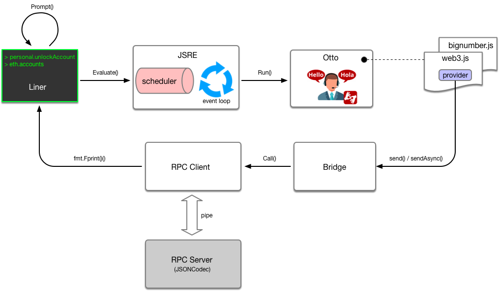

以太坊命令行geth

1. 概念：geth是go-ethereum中最主要到的一个命令行工具，也是各种网络的接入点，支持全节点和轻节点模式，其它程序也可以通过暴露的JSON RPC接口调用访问以太坊网络。

2. 主要引用第三方的cli包实现
   1. 源码地址：https://gopkg.in/urfave/cli.v1
   2. 概念：一个基于go开发的用于在go里面构建命令行的应用程序 

3. geth启动流程分析

   1. 通过init做一个geth整体初始化

   2. 代码

      ```
      func init() {
      	// Initialize the CLI app and start Geth
      	// 命令/行为，如果用户没有输入其他子命令，就调用这个字段指向的函数
      	app.Action = geth
      	app.HideVersion = true // we have a command to print the version
      	app.Copyright = "Copyright 2013-2017 The go-ethereum Authors"
      	// 所有支持的子命令
      	app.Commands = []cli.Command{
      		// See chaincmd.go:
      		initCommand,
      		...
      	}
      	// 通过sort函数对cli的所有子命令基于首字母进行排序
      	sort.Sort(cli.CommandsByName(app.Commands))
      	// 所有能够解析的options
      	app.Flags = append(app.Flags, nodeFlags...)
      	...
      	// 前置，在所有命令调用之前执行的函数
      	app.Before = func(ctx *cli.Context) error {
      		// 设置用于当前程序的CPU个数上限，go语言
      		runtime.GOMAXPROCS(runtime.NumCPU())
      		if err := debug.Setup(ctx); err != nil {
      			return err
      		}
      		// Start system runtime metrics collection
      		// 启动专门的监控协程，收集正在运行的进程的各种指标，3s一次
      		go metrics.CollectProcessMetrics(3 * time.Second)
      		// 指定网络，主网或者其他测试网络
      		utils.SetupNetwork(ctx)
      		return nil
      	}
      	// 后置，在所有命令调用之后执行的函数
      	app.After = func(ctx *cli.Context) error {
      		debug.Exit()
      		// 重置终端
      		console.Stdin.Close() // Resets terminal mode.
      		return nil
      	}
      }
      
      ```

4. 通过geth函数默认启动（在没有调用其他子命令的情况下默认启动geth）

   1. 代码

      ```
      // 如果没有特定指定其他子命令，geth则为默认的系统入口
      // 主要根据提供的参数创建一个默认的节点
      // 以阻塞的方式来运行节点，直到节点被终止
      func geth(ctx *cli.Context) error {
      	// 创建一个节点
      	node := makeFullNode(ctx)
      	// 启动节点
      	startNode(ctx, node)
      	// 等待，直到节点停止
      	node.Wait()
      	return nil
      }
      ```

   2. 创建节点

      ```
	   // 创建一个节点
      // 先注册节点，然后注册各种服务
	   func makeFullNode(ctx *cli.Context) *node.Node {
      	// 根据配置创建node
      	stack, cfg := makeConfigNode(ctx)
      	// 注册服务，把以太坊客户端添加到stack中
	   	utils.RegisterEthService(stack, &cfg.Eth)
	   
	   	...
	   	// Whisper主要用于加密通讯
	   	shhEnabled := enableWhisper(ctx)
	   	shhAutoEnabled := !ctx.GlobalIsSet(utils.WhisperEnabledFlag.Name) && ctx.GlobalIsSet(utils.DeveloperFlag.Name)
	   	if shhEnabled || shhAutoEnabled {
	   		...
	   		// 注册ssh服务
	   		utils.RegisterShhService(stack, &cfg.Shh)
	   	}
	   
	   	// Add the Ethereum Stats daemon if requested.
	   	if cfg.Ethstats.URL != "" {
	   		utils.RegisterEthStatsService(stack, cfg.Ethstats.URL)
	   	}
	   
	   	// Add the release oracle service so it boots along with node.
	   	if err := stack.Register(func(ctx *node.ServiceContext) (node.Service, error) {
	   		...
	   	}); err != nil {
	   		utils.Fatalf("Failed to register the Geth release oracle service: %v", err)
	   	}
	   	return stack
	   }
	   ```

5. 启动节点
6. 等待节点终止
7. 总结：整个启动过程其实就是在解析参数，然后创建、启动节点，再把服务注入到节点中。所有与以太坊相关的功能都是以服务的形式存在。


https://blog.csdn.net/TurkeyCock/article/details/89295196



