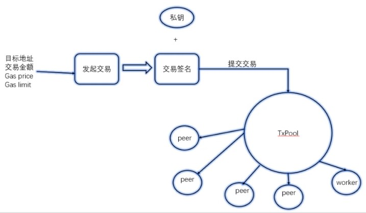

1. 以太坊交易源码分析
   1. 区块之间转账的基本概念以及流程
      1. 转账源地址，目标地址，金额
      
      2. 以太坊交易基本流
      
         
      
      3. 完整流程
      
         	1. 发起交易
         	2. 交易签名
         	3. 提交交易
         	4. 广播交易：通知EVM执行，同事把交易信息广播给其他节点
      
      4. transaction.go
      
         1. 定义交易基本结构
         2. 新建交易
      
      5. 交易源码
      
         入口：internal/ethapi -> func (s *PublicTransactionPoolAPI) SendTransaction
      
         a）发起交易：在本地生成新的交易，准备发送到txPool
      
         b）签名交易：对交易数据进行签名
      
         c）提交交易：提交到缓存池中，先提交到queue（一个包含了不可执行交易的列表，也就是刚刚加入队列），再提交到pending（待处理的交易列表），再对签名进行验证，提交到交易缓存池中
      
         d）交易广播（通过事件的订阅实现）
      
         ​	i. 提交给EVM执行
      
         ​	ii.广播给其它节点
         
         
