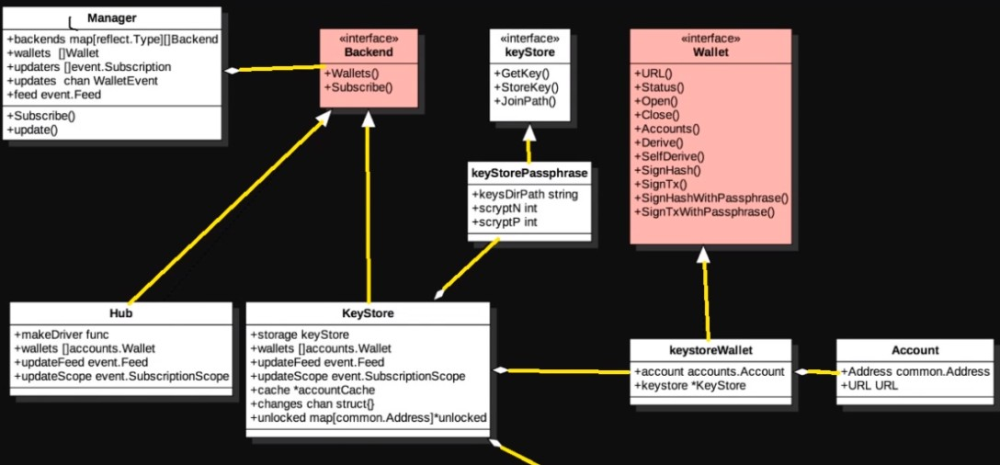
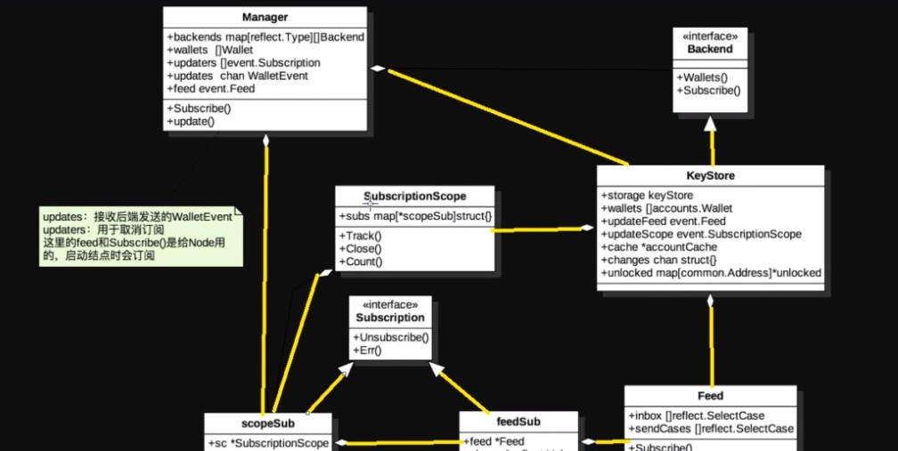

以太坊账户管理

account

1. 如何实现通过geth生成以太坊地址

   通过geth生成地址：personal.newAccount(password)

   入口：geth/main.go -> accountCommand

2. Accounts源码分析：在accounts包中，

   1. 主要实现了以太坊客户端的钱包管理和账户管理。提供了两种钱包，分别是keystore和usb。同时以太坊合约代码的ABI也在accounts中实现。

   2. 源码分析

      accounts.go

      manager.go

   3. 钱包列表获取与事件流程

      1. 钱包相关架构图

      

      2. 通过架构图，可以看到一个wallet中可以包含多个account，每个account中包含一个address结构（address，URL）
      3. 核心接口
         1. Backend接口
            1. Backend接口：钱包后端，目前实现了keystore钱包和USB硬件钱包
            2. Wallet接口：单个钱包包含了一些打开、关闭、签名相关的接口函数
      4. 钱包事件

      

      		1. Manager中：updates字段，channel类型，主要用于接收钱包相关的事件。Manager需要调用backend的subscribe函数注册channel
        		2. KeyStore：后端的事件，把注册请求转发给feed实例
        		3. feed把channel记录下来
        		4. Manager可以通过该接口取消订阅
